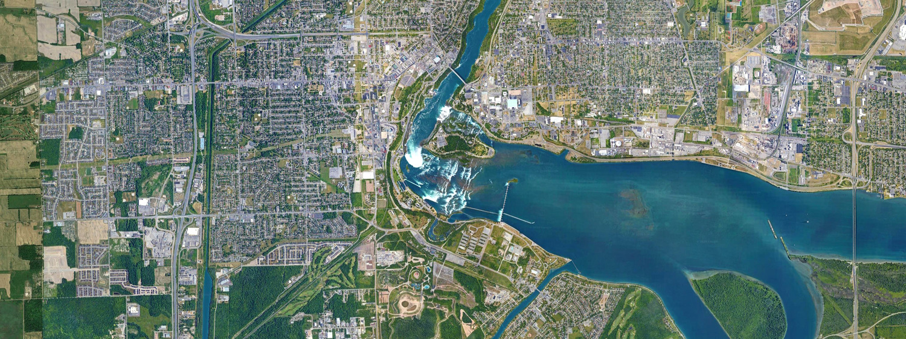

# gomati

*A simple Google Maps tile downloader and stitcher.*


## Setup & Usage

Since Gomati is a **humble shell script**, you'll need `bash`, along with common command-line utilities – the only ones I'm not confident you already have are `curl` and `imagemagick`. Your package manager probably provides them.

Using this tool is as simple as **entering your desired latitude and longitude** in the source code, optionally taking a peek at the other parameters you can modify, and running:

```
bash gomati.sh
```

A more detailed **list of requirements and usage/configuration instructions**, along with a couple of tips and tricks, is **located at the top of `gomati.sh`**.




## FAQ

### Why the name?

Gomati stands for **Go**ogle **Ma**ps **Ti**les and is apparently also a [river in India](https://en.wikipedia.org/wiki/Gomti_River).

### Why did you make this tool?

Because satellite imagery [can be extremely beautiful](https://earthview.withgoogle.com), and I was looking for a way of easily downloading high-resolution satellite views of arbitrary locations such as [the center pivot irrigation farms of the American heartland](http://www.thegreatamericangrid.com/archives/1441).

### Does this violate Google's terms of use?

Probably. I haven't checked. But they haven't banned my IP for downloading tens of thousands of map tiles during development and testing, so you're probably good as long as you don't go crazy downloading a centimeter-scale map of your country.

### What's the maximum map size?

The limiting factor is probably RAM during the stitching step: I've grabbed an 80-by-80 tile map (that's 6400 tiles for those of you keeping track at home) of my hometown, and ImageMagick ate about 12 GB of RAM while stitching them together into a 20480x20480, 420M pixel image.

(The effectively-free Google Maps Static API [limits you](https://developers.google.com/maps/documentation/maps-static/dev-guide#Imagesizes) to 1280x1280 pixels unless you're grandfathered into a discontinued premium plan, as I've learned after building Gomati.)

### Why is this tool so slow?

Since it's a shell script, there's zero multithreading and a whole bunch of context-switching overhead, plus I made a real fancy progress indicator that's updated in a tight loop (i.e. a lot of string manipulation happens frequently). I should have implemented this in Python – and I would've, if only I had anticipated the amount of feature creep I ended up sneaking in.

(The slowness isn't an issue if you use Gomati as I indend to use it: occasionally grabbing a 100ish tile map, which takes fewer than 30 seconds. Think of at as, uh, a totally intentional rate-limiting feature.)

### How do you determine tile coordinates based on latitude and longitude?

By plugging them into the surprisingly simple [Web Mercator Projection](https://en.wikipedia.org/wiki/Web_Mercator_projection) formulas.

### This thing only does satellite images, not road maps – I want my money back!

Not a question, but sure: 💵

### You know, it'd be really neat if there was, like, a Twitter bot based on this tool!

Not a question, but sure: Meet [@americasquared](https://twitter.com/americasquared).

### Something is broken – can you fix it?

Possibly. Please feel free to [file an issue](https://github.com/doersino/gomati/issues) – I'll be sure to take a look!
